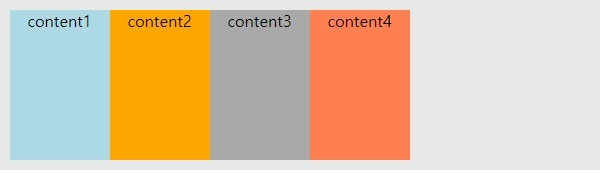
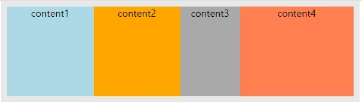
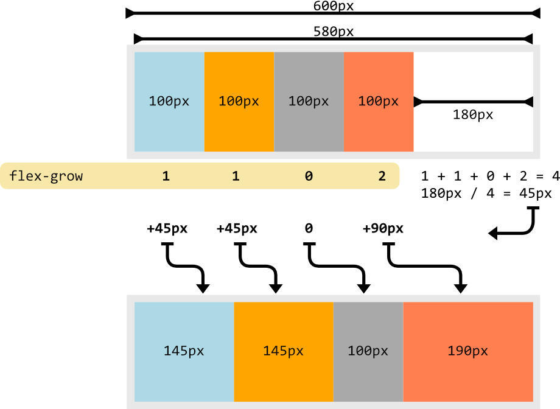
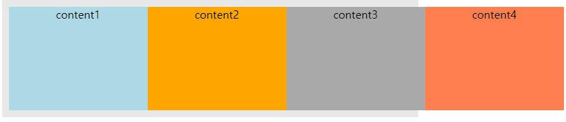
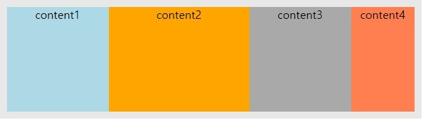
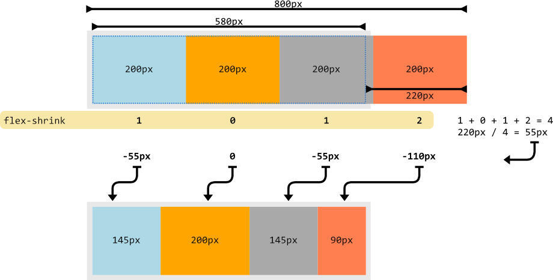
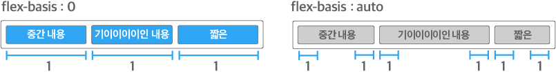
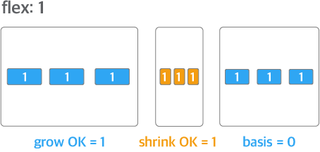

# flex: 1 ?

> 리뷰를 하던도중 `flex: 1`을 만나고 다시 학습

<br />

- `flex` 속성은 `flex-grow`, `flex-shrink`, `flex-basis`를 한번에 나타낸다.
- `flex-grow`와 `flex-shrink`는 `flex-basis` 속성으로 정한 flex box의 기본 너비를 자동으로 늘어나거나(grow), 줄어들도록(shrink)해서 행 안을 적절한 너비로 배치하는 기능

## 1. flex-grow

- 레이아웃 너비보다 아이템들의 너비 합이 더 작다면 그 차이만큼 여백이 남게된다.

  

- 그런데 만약 `flex-grow`속성을 부여하면 다음처럼 주어진 비율대로 늘어나면서 레이아웃 영역을 채우게 된다.
  (`flex-basis`를 제외한 나머지 여백을 해당 비율로 나눠 갖는다)

  ```css
  .item:nth-child(1) {
    flex-grow: 1;
  }
  .item:nth-child(2) {
    flex-grow: 1;
  }
  .item:nth-child(3) {
    flex-grow: 0;
  }
  .item:nth-child(4) {
    flex-grow: 2;
  }
  ```

  

- 원리

  - flex box 안의 아이템들에 적용된 `flex-grow`속성 값의 합을 구한다: **4**
  - 남은 여백을 위에서 구한 합으로 나눈다. (ex. 180px / 4 = 45px) (padding은 제외)
  - `flex-grow`속성 값의 비율 만큼 아이템 너비를 더한다.

  

## 2. flex-shrink

- `flex-grow`와 반대로 레이아웃 너비보다 아이템들의 너비 합이 커지면 그 차이 만큼 줄이는 기능
- `flex-wrap: wrap;` 속성을 부여하면 적용되지 않는다. (레이아웃 영역을 넘는 상황이 생기지 않음)
- 기본 값이 1(`flex-shrink: 1`)이어서 자동으로 아이템 축소가 적용된다.
- 예시

  

  ```css
  .item:nth-child(1) {
    flex-shrink: 1;
  }
  .item:nth-child(2) {
    flex-shrink: 0;
  }
  .item:nth-child(3) {
    flex-shrink: 1;
  }
  .item:nth-child(4) {
    flex-shrink: 2;
  }
  ```

  

  - flex box 안의 아이템들에 적용된 `flex-shrink`속성 값의 합을 구한다: **4**
  - 초과한 여백을 위에서 구한 합으로 나눈다. (ex. 220px / 4 = 55px) (padding은 제외)
  - `flex-shrink`속성 값의 비율 만큼 아이템 너비를 줄인다.

  

## 3. flex-basis

- flex item의 기본 크기
- 기본 값인 `auto`는 컨텐츠의 너비를 의미 (relative flex item)
- `flex-direction`이 `row`일 때는 너비, `column`일 때는 높이를 의미
- px, %, rem 등 모든 단위 사용 가능 (값을 설정하면 item의 크기는 고정된다.)
  
- 속성 값을 0으로 설정하면 absolute flex item이 돼서 flex container를 기준으로 크기가 결정된다. (0으로 설정할 때는 단위도 함께 적어줘야한다. 0px 0%)
  

## 4. flex: 1 (= flex: 1 1 0)

- `flex-grow` 속성과 `flex-shrink` 속성, `flex-basis` 속성을 축약해서 flex 속성으로 표현
- `flex-grow` 속성의 값이 '1'이고 `flex-shrink` 속성의 값이 '1'이기 때문에 flex container의 크기에 따라 flex item의 크기도 커지거나 작아진다는 의미



- flex 속성의 값으로 정수 하나만 선언하면 선언한 값은 `flex-grow` 속성의 값이 된다. (나머지는 기본값인 `flex-shrink: 1` 속성과 `flex-basis: 0` 속성이 적용)
  ex) `flex: 2`는 `flex: 2 1 0`, `flex: 3`은 `flex: 3 1 0`

> `display:flex` 를 가지고 있는 노드가 flex container가 되고 flex item(flex-container안에 있는 노드들)중에 `flex: 1`을 가지고 있는 자식이 있으면 그 자식은 container의 여백을 다 채우는 역할을 한다.  
> 주의할 점은 부모가 flex container가 아닌 경우에는 `flex: 1` 을 해도 아무 소용이 없다.

<br />

## Reference

- [CSS 플렉스박스(flex) flex-grow와 flex-shrink 속성의 완벽 이해](https://blogpack.tistory.com/863)
- [flex: 1 1 0 의 의미](https://heewon26.tistory.com/275#recentComments)
- [[CSS] flex:1의 의미](https://velog.io/@mooongs/flex1%EC%9D%98-%EC%9D%98%EB%AF%B8)
