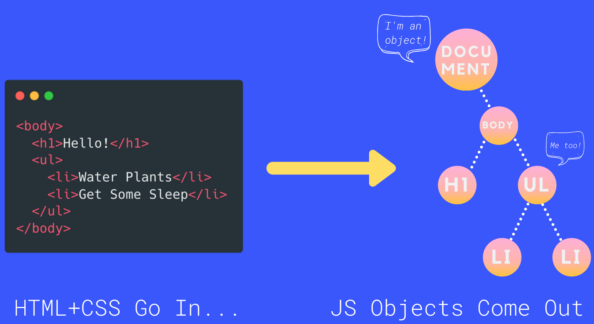

# DOM

> [udemy의 'The Web Developer 부트캠프 2022'](https://www.udemy.com/course/the-web-developer-bootcamp-2021-korea/)강의를 듣고 내용 정리

## 1. DOM 개요

- Document Object Model로 웹 페이지를 구성하는 JavaScript 객체들의 집합이다.
  - ex. h1 태그는 이를 모델링하는 JavaSciprt 객체가 있다.
  - 실제로 그 객체에 접근해서 h1을 변경하면 페이지에 변경 사항이 반영된다.
- DOM은 JS에서 웹페이지의 콘텐츠로 접근하는 창이자 통로이다. → JS로 HTML, CSS를 다룰 수 있다는 것! → 결국 페이지에 여러 다양한 효과를 줄 수 있게된다. (ex. 클릭이나 드래그에 반응하는 유용한 메서드와 프로퍼티가 포함되어 있다.)

 

## 2. Document Object

- 브라우저가 웹 페이지를 띄울 때 HTML과 CSS 정보를 받아들인 다음 요소와 스타일을 기반으로 JS 객체를 생성한다.
  
- 객체마다 고유의 타입을 나타내는 특성을 갖게 된다.(href, src, innerText 등)
- 각 객체는 단독으로 존재하는 것이 아니라 모두 연결돼있다.(서로 관계를 가짐) → 트리구조
- Document: 트리 구조의 최상위에 있는 가장 중요한 요소이자 가장 중요한 객체
  - chrome에서 document를 보면 편의상 html로 보여준다 → 객체 구조로 보려면 console.dir사용
  - 모든 하위 객체들이 모여 document안에 표현되게 된다.(최상위 폴더와 비슷)
- document.all을 사용하면 HTMLALLCollection(유사 배열)이 반환되서 index로 접근 가능하다.

 

## 3. Selecting Method

- 텍스트, HTML, CSS를 직접 선택하는 것이 아니라 DOM의 Element(요소 노드)를 선택하는 것

### 3.1. getElementById

- document에 사용
- 문자열로 전달 -> 일치하는 ID를 가진 Element를 찾아낸다.
- 일치하는 요소가 없으면 null 반환
- 반환하는 값이 console창에는 HTML같이 출력되지만 실제로 HTML이 아니라 Element(요소 노드) (Chrome에서 편의상 HTML처럼 보여주는 것)

### 3.2. getElementsByTagName & getElementsByClassName

- Element's'에서 알 수 있듯 다수의 Element들을 반환한다.
- 일치하는 모든 요소를 찾아서 반환한다.
- 일치하는 요소가 없으면 null 반환
- HTMLCollection을 반환한다.
  - HTMLCollection은 Element들을 가지고 있다.
  - HTMLCollection은 유사배열이면서 이터러블 (반복문 사용가능)
  - 배열로 변환해서 사용하기 (live 객체이기 때문에 예상치 못한 에러가 발생할 수 있다.)

 

cf) [Element](https://developer.mozilla.org/ko/docs/Web/API/Element)

- JS의 객체
- 하나의 HTML 요소를 나타낸다 -> property들을 가지고 있다.

 

### 3.3. querySelector

- 비교적 더 최근에 추가된 메서드
- id, className, tagName, 타입, 속성, CSS 스타일 등 원하는 선택자를 querySelector에 전달해서 요소를 선택할 수 있다.
- 메서드에 CSS에 사용하는 선택자를 넣어준다.
  - 예시: `document.querySelector('img:nth-of-type(2)')`, `document.querySelector('a[title="Java"]')`
- 일치하는 요소 중 첫번째 요소만 반환한다.

### 3.4. querySelectorAll

- querySelector와 원리는 같지만 일치하는 모든 요소를 반환한다.
- NodeList형태로 반환
  - HTMLCollection과 같이 반복문 사용가능
  - HTMLCollection과 마찬가지로 배열로 변환 후 사용하기

 

## 4. Manipulate

### 4.1. Content

- **innerText**: 선택한 요소의 여는 태그와 닫는 태그 사이에 있는 택스트를 반환한다.

- **textContent**: 선택한 요소 안에 있는 '모든' 텍스트 요소를 반환한다. (코드 에디터에서 작성한 포멧의 형태(줄바꿈까지) 그대로 표시된다.)

- **innerText와 textContent 차이점**

  - innerText는 CSS에 의존적이다: `display: none`, `visibility: hidden`과 같이 화면에 보이지 않는 요소는 반환하지 않는다.
  - textContent는 '모든'요소를 반환한다.
  - innerText는 CSS에 의존적이기 때문에 고려해야할 것이 많아 textContent보다 느리게 동작한다.

- **innerText, textContent를 사용해서 요소 조작**

  - 선택한 요소 내부의 값이 새로운 값(텍스트)으로 완전 덮어씌워진다.
  - HTML 파싱이 이루어지지 않는다: 태그를 사용해도 그냥 텍스트로 값이 들어가진다.

- **innerHTML**

  - 선택한 요소 내부에 있는 마크업 전체 내용을 반환한다.
  - 값을 set해줄 때 HTML을 파싱해서 set해준다.
  - `+=` 연산자를 사용해서 값을 연속해서 추가해줄 수 있지만 실제로 새로운 값만 추가되는 것이 아니라 모두 새롭게 만들어서 다시 담아준다.  
    -> 비효율적

### 4.2. Attribute

- 선택한 요소의 property로 접근 할 수 있다. (get, set 모두 가능): 다루는 값은 최신 attribute
- getAttribute, setAttribute 메서드로도 접근하고 조작할 수 있다: 다루는 값은 attribute의 초기값
- 두가지 방법이 다루는 값이 달라 보이지만 사용자 입력에 의한 상태변화와 관계가 있는 것(input의 value 등)을 제외하고는 동일한 값으로 연동된다.
  - 예외: href의 경우에는 값이 차이가 있을 수 있다: HTML이 DOM객체로 변할 때 최종 계산된 값이 property에 담기게 되고 HTML 속성 초기값은 그대로 attribute node에 답기게 돼서 차이가 생긴다.

### 4.3. Style

- style property는 요소의 inline style을 다룬다(get, set 모두 가능): CSS로 적용한 스타일은 property에 담겨있지 않다. -> inline style을 다루므로 좋은 방법은 아니다.  
  => **class 사용해서 스타일 적용하기!**: CSS에 class로 스타일을 정의한 후 그 class를 요소에 추가하거나 제거하는 방식으로 스타일 조작
- CSS는 우선순위도 복잡하고 고려해야할 것이 많다. 그렇지만 최종 계산되서 적용된 스타일을 JS로 가지고 오고 싶을 수 있다: `window.getComputedStyle(element)`를 사용하면 계산된 스타일을 가지고 올 수 있다.(CSSStyleDeclaration으로 반환)  
  -> 잘 사용되진 않지만 현재 사이즈에서 추가로 계산해서 스타일을 주고 싶은 경우에 사용할 수 있다.
