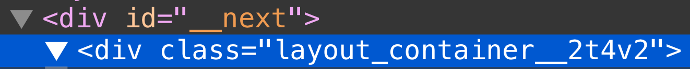

# Assets, Metadata, and CSS

> Next.js 공식문서 CREATE YOUR FIRST APP 중 [Assets, Metadata, and CSS](https://nextjs.org/learn/basics/assets-metadata-css)내용들을 정리했습니다.

<br />

## 1. Assets

Next.js는 **최상위 디렉토리인** [`public`](https://nextjs.org/docs/basic-features/static-file-serving)을 통해 이미지와 같은 **정적 asset**을 제공한다. `public` 내부의 파일은 [`pages`](https://nextjs.org/docs/basic-features/pages)와 유사하게 응용 프로그램의 루트에서 참조할 수 있다.

`public` 디렉토리는 `robots.txt`, Google Site Verification 및 기타 정적 asset에도 유용하다. 자세한 내용은 [정적 파일 제공](https://nextjs.org/docs/basic-features/static-file-serving)에 대한 설명서를 확인

### 1.1. Download Your Profile Picture

먼저 프로필 사진을 검색

- 프로필 사진을 `.jpg` 형식으로 다운로드(혹은 [이 파일을 사용](https://github.com/vercel/next-learn/blob/master/basics/basics-final/public/images/profile.jpg))
- [`public` 디렉토리](https://nextjs.org/docs/basic-features/static-file-serving) 내에 `images` 디렉토리를 만든다.
- 사진을 `public/images` 디렉토리에 `profile.jpg`로 저장
- 이미지 크기는 약 400x400px
- [`public` 디렉토리](https://nextjs.org/docs/basic-features/static-file-serving)에서 직접 사용하지 않는 SVG 로고 파일을 제거

### 1.2. Unoptimized Image

일반 HTML을 사용하면 다음과 같이 프로필 사진을 추가

```html

```

다음은 수동으로 처리:

- 다양한 화면 크기에서 이미지가 반응하는지 확인
- 타사 도구 또는 라이브러리로 이미지 최적화
- 뷰포트에 들어갈 때만 이미지를 로드

Next.js는 이를 처리해주는 `Image` component를 제공한다.

### 1.3. Image Component and Image Optimization

[`next/image`](https://nextjs.org/docs/api-reference/next/image): 현대 웹을 위해 진화된 HTML `` element

Next.js는 기본적으로 이미지 최적화도 지원한다. 이를 통해 [WebP](https://developer.mozilla.org/en-US/docs/Web/Media/Formats/Image_types#webp)와 같은 최신 형식으로 이미지 크기 조정, 최적화 및 제공이 가능하다(브라우저가 지원가능 해야함). 이렇게 하면 뷰포트가 작은 장치에 큰 이미지가 전달되는 것을 방지할 수 있다. 또한 Next.js는 향후 이미지 형식을 자동으로 채택하고 해당 형식을 지원하는 브라우저에 제공할 수 있다.

자동 이미지 최적화는 모든 이미지 소스에서 작동한다. 이미지가 CMS와 같은 외부 데이터 소스에서 호스팅되는 경우에도 여전히 최적화할 수 있다.

### 1.4. Using the Image Component

Next.js는 빌드 시에 이미지를 최적화하지 않고 사용자가 요청할 때 주문형으로 이미지를 최적화한다. 정적 사이트 생성기 및 정적 전용 솔루션과 달리 10개의 이미지를 배송하든 1천만 개의 이미지를 배송하든 빌드 시간이 늘어나지 않는다.

이미지는 기본적으로 지연 로드된다. 즉, 뷰포트 외부의 이미지 때문에 페이지 속도가 저하되지 않는다. 이미지가 뷰포트로 스크롤되면서 로드된다.

이미지는 항상 Google이 [검색 순위에 사용](https://developers.google.com/search/blog/2020/05/evaluating-page-experience)할 [Core Web Vital](https://web.dev/vitals/#core-web-vitals)인 [누적 레이아웃 이동](https://web.dev/cls/)을 피하는 방식으로 렌더링된다.

다음은 프로필 사진을 표시하기 위해 [`next/image`](https://nextjs.org/docs/api-reference/next/image)를 사용하는 예이다. `height` 및 `width` props는 소스 이미지와 동일한 종횡비로 원하는 렌더링 크기여야 한다.

```tsx
import Image from "next/image";

const YourComponent = () => (
  <Image
    src="/images/profile.jpg" // Route of the image file
    height={144} // Desired size with correct aspect ratio
    width={144} // Desired size with correct aspect ratio
    alt="Your Name"
  />
);
```

<br />

## 2. Metadata

`<title>` HTML 태그와 같은 페이지의 메타데이터를 수정하려면 어떻게 해야 할까?

`<title>`은 `<head>` HTML 태그의 일부이므로 Next.js 페이지에서 `<head>` 태그를 수정하는 방법을 살펴보자.

```tsx
// pages/index.tsx

<Head>
  <title>Create Next App</title>
  <link rel="icon" href="/favicon.ico" />
</Head>
```

소문자 `<head>` 대신 `<Head>`를 사용한다. `<Head>`는 Next.js에 내장된 React component이다. 페이지의 `<head>`를 수정할 수 있다.

[`next/head`](https://nextjs.org/docs/api-reference/next/head) 모듈에서 'Head` component를 가져올 수 있다.

### 2.1. Adding Head

파일 시작 부분에 [`next/head`](https://nextjs.org/docs/api-reference/next/head)에서 `Head`에 대한 import를 추가한다.

```tsx
import Head from "next/head";
```

그런 다음 `Head` component를 포함하도록 업데이트한다. 지금은 제목 태그만 추가하겠다.

```tsx
export default function FirstPost() {
  return (
    <>
      <Head>
        <title>First Post</title>
      </Head>
      <h1>First Post</h1>
      <h2>
        <Link href="/">← Back to home</Link>
      </h2>
    </>
  );
}
```

이제 브라우저 탭에 "First Post"가 표시된다. 브라우저의 개발자 도구를 사용하면 `title` 태그가 `<head>`에 추가된 것을 볼 수 있다.

> lang 속성을 추가하는 등 `<html>` 태그를 사용자 정의하려면 `pages/_document.js` 파일을 생성하면 된다. ([`Custom Document` documentation](https://nextjs.org/docs/advanced-features/custom-document))

Next.js는 [CSS](https://nextjs.org/docs/basic-features/built-in-css-support)와 [Sass](https://nextjs.org/docs/basic-features/built-in-css-support#sass-support)를 기본적으로 지원한다.

<br />

## 3. Third-Party JavaScript

Third-Party JavaScript는 third-party 소스에서 추가된 모든 스크립트를 나타낸다. 일반적으로 분석, 광고 및 고객 지원 위젯과 같이 처음부터 작성할 필요가 없는 최신 기능을 사이트에 도입하기 위해 third-party 스크립트를 활용한다.

### 3.1. Adding Third-Party JavaScript

Next.js 페이지에 third-party 스크립트를 추가하는 방법을 살펴보겠다.

```tsx
<Head>
  <title>First Post</title>
  <script src="https://connect.facebook.net/en_US/sdk.js" />
</Head>
```

메타데이터 외에도 로드하고 실행해야 하는 스크립트는 일반적으로 페이지의 `<head>` 내에 추가한다. 일반 HTML `<script>` 요소를 사용하면 위와 같이 외부 스크립트를 추가한다.

이 접근 방식은 작동하지만 이 방식으로 스크립트를 추가하면 다른 JavaScript 코드와 비교해서 언제 로드될지 명확하게 알 수 없다. 특정 스크립트가 렌더링을 차단하고 페이지 콘텐츠 로드를 지연시키는 경우 성능에 상당한 영향을 미칠 수 있다.

### 3.2. Script Component

[`next/script`](https://nextjs.org/docs/api-reference/next/script)는 HTML `<script>` 요소의 확장이며 추가 스크립트를 가져와 실행할 때 최적화한다.

```tsx
import Script from "next/script";

export default function FirstPost() {
  return (
    <>
      <Head>
        <title>First Post</title>
      </Head>
      <Script
        src="https://connect.facebook.net/en_US/sdk.js"
        strategy="lazyOnload"
        onLoad={() =>
          console.log(`script loaded correctly, window.FB has been populated`)
        }
      />
      <h1>First Post</h1>
      <h2>
        <Link href="/">← Back to home</Link>
      </h2>
    </>
  );
}
```

#### **Script component property**

- `strategy`는 third-party 스크립트를 로드해야 하는 시기를 제어한다. `lazyOnload` 값은 브라우저 유휴 시간 동안 스크립트를 느리게 로드하도록 Next.js에 지시한다.

- `onLoad`는 스크립트 로드가 완료된 직후 JavaScript 코드를 실행하는 데 사용된다. 위의 예시에서는 스크립트가 올바르게 로드되었다는 메시지를 콘솔에 기록한다.

> `Script` component에 대해 자세히 알아보려면 [documentation](https://nextjs.org/docs/basic-features/script)를 확인

<br />

## 4. CSS Styling

[CSS 모듈](https://nextjs.org/docs/basic-features/built-in-css-support)을 사용하면 고유한 클래스 이름을 자동으로 생성하여 component 수준에서 CSS 범위를 정할 수 있다. 이를 통해 클래스 이름 충돌에 대한 걱정 없이 다른 파일에서 동일한 CSS 클래스 이름을 사용할 수 있다.

CSS 모듈 외에도 다음과 같은 다양한 방법으로 Next.js 애플리케이션의 스타일을 지정할 수 있다.

- `.css` 및 `.scss` 파일을 가져올 수 있는 [Sass](https://nextjs.org/docs/basic-features/built-in-css-support#sass-support)
- [Tailwind CSS](https://github.com/vercel/next.js/tree/canary/examples/with-tailwindcss)와 같은 PostCSS 라이브러리
- [styled-jsx](https://github.com/vercel/styled-jsx), [styled-components](https://github.com/vercel/next.js/tree/canary/examples/with-styled-components) 및 [emotion](https://github.com/vercel/next.js/tree/canary/examples/with-emotion)과 같은 CSS-in-JS 라이브러리

<br />

## 5. Layout Component

```jsx
// components/layout.js

export default function Layout({ children }) {
  return <div>{children}</div>;
}
```

```jsx
// pages/posts/first-post.js

import Head from "next/head";
import Link from "next/link";
import Layout from "../../components/layout";

export default function FirstPost() {
  return (
    <Layout>
      <Head>
        <title>First Post</title>
      </Head>
      <h1>First Post</h1>
      <h2>
        <Link href="/">← Back to home</Link>
      </h2>
    </Layout>
  );
}
```

### 5.1. Adding CSS

이제 `Layout` component에 몇 가지 스타일을 추가해 보겠다. 이를 위해 React component에서 CSS 파일을 가져올 수 있는 [CSS 모듈](https://nextjs.org/docs/basic-features/built-in-css-support#adding-component-level-css)을 사용한다.

```css
/* components/layout.module.css */

.container {
  max-width: 36rem;
  padding: 0 1rem;
  margin: 3rem auto 6rem;
}
```

> [CSS 모듈](https://nextjs.org/docs/basic-features/built-in-css-support#adding-component-level-css)을 사용하려면 CSS 파일 이름이 `.module.css`로 끝나야 한다.

`components/layout.js` 내에서 `container` 클래스를 사용하려면 다음을 수행해야 한다.

- CSS 파일을 가져오고 `styles`라고 이름을 지정한다.
- `styles.container`를 `className`으로 사용

```jsx
// components/layout.js

import styles from "./layout.module.css";

export default function Layout({ children }) {
  return <div className={styles.container}>{children}</div>;
}
```


### 5.2. Automatically Generates Unique Class Names

브라우저의 개발자 도구에서 HTML을 살펴보면 `Layout` component에 의해 렌더링된 `div`에 `layout_container__...`와 같은 클래스 이름이 있음을 확인할 수 있다.



이것이 [CSS 모듈](https://nextjs.org/docs/basic-features/built-in-css-support#adding-component-level-css)이 하는 일이다. 고유한 클래스 이름을 자동으로 생성한다. CSS 모듈을 사용하는 한 클래스 이름 충돌에 대해 걱정할 필요가 없다.

또한 Next.js의 코드 분할 기능은 [CSS 모듈](https://nextjs.org/docs/basic-features/built-in-css-support#adding-component-level-css)에서도 작동한다. 각 페이지에 최소한의 CSS가 로드되도록 한다. 그 결과 번들 크기가 더 작아진다.

[CSS 모듈](https://nextjs.org/docs/basic-features/built-in-css-support#adding-component-level-css)은 빌드 시 JavaScript 번들에서 추출되며 Next.js에 의해 자동으로 로드되는 `.css` 파일을 생성한다.

> Next.js가 기본적으로 지원하는 스타일 지정 방법: CSS Modules, Sass, styled-jsx
