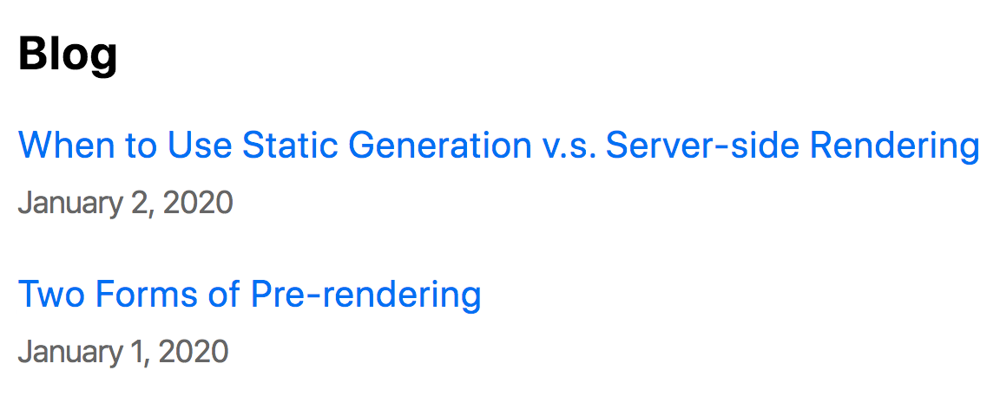

# Dynamic Routes

> Next.js 공식문서 CREATE YOUR FIRST APP 중 [Dynamic Routes](https://nextjs.org/learn/basics/dynamic-routes)내용들을 정리했습니다.

<br />

우리는 페이지의 URL이 데이터에 의존하기를 원할 수 있다. 이를 위해선 [동적 경로](https://nextjs.org/docs/routing/dynamic-routes)를 사용해야 한다.

### 이 단원에서 배울 내용

- [동적 경로](https://nextjs.org/docs/routing/dynamic-routes)에서 [`getStaticPaths`](https://nextjs.org/docs/basic-features/data-fetching/overview#getstaticpaths-static-generation)를 사용해서 페이지를 정적으로 생성하는 방법
- 각 블로그 게시물에 대한 데이터를 가져오기 위해 [`getStaticProps`](https://nextjs.org/docs/basic-features/data-fetching/overview#getstaticprops-static-generation)를 작성하는 방법.
- [`remark`](https://github.com/remarkjs/remark)를 사용하여 마크다운을 렌더링하는 방법.
- 날짜 문자열을 예쁘게 인쇄하는 방법.
- [동적 경로](https://nextjs.org/docs/routing/dynamic-routes)가 있는 페이지에 연결하는 방법.
- [동적 경로](https://nextjs.org/docs/routing/dynamic-routes)에 대한 몇 가지 유용한 정보

<br />

## 1. 외부 데이터에 따른 페이지 경로

**페이지 콘텐츠**가 외부 데이터에 의존하는 경우를 다루어 봤다. [`getStaticProps`](https://nextjs.org/docs/basic-features/data-fetching/overview#getstaticprops-static-generation)를 사용하여 인덱스 페이지를 렌더링하는 데 필요한 데이터를 가져왔었다.

이번엔 각 **페이지 경로**가 외부 데이터에 의존하는 경우에 대해 이야기해보겠다. Next.js를 사용하면 외부 데이터에 의존하는 경로로 페이지를 정적으로 생성할 수 있다. 이렇게 하면 Next.js에서 `동적 URL`이 활성화된다.


### 1.1. 동적 경로로 페이지를 정적으로 생성하는 방법

블로그 게시물에 대한 [`동적 경로`](https://nextjs.org/docs/routing/dynamic-routes)를 만들고 싶은 경우:

- 각 게시물의 경로는 `/posts/<id>`이며, 여기서 `<id>`는 `posts` 디렉터리 아래의 마크다운 파일 이름이다.
- `ssg-ssr.md` 및 `pre-rendering.md`가 있으므로 경로를 `/posts/ssg-ssr` 및 `/posts/pre-rendering`으로 지정하고 싶은 경우이다.

### 1.2. Overview of the Steps

먼저 `pages/posts` 아래에 `[id].js`라는 페이지를 만든다. `[`로 시작하고 `]`로 끝나는 페이지는 Next.js의 [동적 경로](https://nextjs.org/docs/routing/dynamic-routes)이다.

`pages/posts/[id].js`에서 다른 페이지와 마찬가지로 게시물 페이지를 렌더링하는 코드를 작성한다.

```jsx
import Layout from "../../components/layout";

export default function Post() {
  return <Layout>...</Layout>;
}
```

이 페이지에서 [`getStaticPaths`](https://nextjs.org/docs/basic-features/data-fetching/overview#getstaticpaths-static-generation)라는 비동기 함수를 export 할거다. 이 함수에서는 `id`에 `가능한 값` 목록을 반환해야 한다.

```jsx
import Layout from "../../components/layout";

export default function Post() {
  return <Layout>...</Layout>;
}

export async function getStaticPaths() {
  // id에 가능한 값 목록을 return
}
```

마지막으로 [`getStaticProps`](https://nextjs.org/docs/basic-features/data-fetching/overview#getstaticprops-static-generation)를 다시 구현해야 한다. 이번에는 주어진 `id`로 블로그 게시물에 필요한 데이터를 가져온다. [`getStaticProps`](https://nextjs.org/docs/basic-features/data-fetching/overview#getstaticprops-static-generation)에는 `id`를 포함하는 `params`가 제공된다(파일 이름이 `[id].js`이기 때문에).

```jsx
import Layout from "../../components/layout";

export default function Post() {
  return <Layout>...</Layout>;
}

export async function getStaticPaths() {
  // id에 가능한 값 목록을 return
}

export async function getStaticProps({ params }) {
  // params.id를 사용하여 블로그 게시물에 필요한 데이터를 가져온다.
}
```


<br />

## 2. Implement getStaticPaths

파일 설정:

- `pages/posts` 디렉터리 내에 `[id].js`라는 파일을 만든다.
- 또한 `pages/posts` 디렉토리에서 `first-post.js`를 제거 — 더 이상 사용하지 않는다.

그런 다음 편집기에서 `pages/posts/[id].js`를 열고 다음 코드를 붙여넣는다. `...`는 나중에 채울거다.

```jsx
import Layout from "../../components/layout";

export default function Post() {
  return <Layout>...</Layout>;
}
```

그런 다음 `lib/posts.js`를 열고 하단에 다음 `getAllPostIds` 함수를 추가한다. `posts` 디렉토리에 있는 파일 이름 목록(`.md` 제외)을 반환한ㄴ다.

```jsx
export function getAllPostIds() {
  const fileNames = fs.readdirSync(postsDirectory);

  // 다음과 같은 배열을 return 한다:
  // [
  //   {
  //     params: {
  //       id: 'ssg-ssr'
  //     }
  //   },
  //   {
  //     params: {
  //       id: 'pre-rendering'
  //     }
  //   }
  // ]
  return fileNames.map((fileName) => {
    return {
      params: {
        id: fileName.replace(/\.md$/, ""),
      },
    };
  });
}
```

**important**: 반환된 목록은 단순한 문자열 배열이 아니라 위의 주석처럼 보이는 개체 배열이어야 한다. 각 객체는 `params` 키를 가지고 있어야 하며 `id` 키가 있는 객체를 포함해야 한다(파일 이름에 `[id]`를 사용하기 때문). 그렇지 않으면 [`getStaticPaths`](https://nextjs.org/docs/basic-features/data-fetching/overview#getstaticpaths-static-generation)가 실패한다.

마지막으로 `getAllPostIds` 함수를 가져와 [`getStaticPaths`](https://nextjs.org/docs/basic-features/data-fetching/overview#getstaticpaths-static-generation) 내에서 사용한다. `pages/posts/[id].js`를 열고 내보낸 `Post` component 위에 다음 코드를 복사한다.

```jsx
import { getAllPostIds } from "../../lib/posts";

export async function getStaticPaths() {
  const paths = getAllPostIds();
  return {
    paths,
    fallback: false,
  };
}
```

- `paths`는 `pages/posts/[id].js`가 정의한 매개변수를 포함하고 `getAllPostIds()`가 반환한 경로 배열이다. [`paths` key 문서](https://nextjs.org/docs/basic-features/data-fetching/overview#the-paths-key-required)에서 자세히 알아보기.
- 지금은 [`fallback: false`](https://nextjs.org/docs/basic-features/data-fetching#fallback-false) 무시하고 넘어가기.

<br />

## 3. Implement getStaticProps

주어진 `id`로 게시물을 렌더링하기 위해 필요한 데이터를 가져와야 한다.

이렇게 하려면 `lib/posts.js`의 가장 아래에 `getPostData` 함수를 추가한다. `id`를 기반으로 게시물 데이터를 반환한다.

```jsx
export function getPostData(id) {
  const fullPath = path.join(postsDirectory, `${id}.md`);
  const fileContents = fs.readFileSync(fullPath, "utf8");

  // gray-matter을 사용하여 게시물 메타데이터 섹션을 구문 분석한다.
  const matterResult = matter(fileContents);

  // 데이터를 id와 결합
  return {
    id,
    ...matterResult.data,
  };
}
```

그런 다음 `pages/posts/[id].js`를 열고 다음 줄을 바꿔준다.

```jsx
import { getAllPostIds, getPostData } from "../../lib/posts";

export async function getStaticProps({ params }) {
  const postData = getPostData(params.id);
  return {
    props: {
      postData,
    },
  };
}
```

게시물 페이지는 이제 `getStaticProps`의 `getPostData` 함수를 사용하여 게시물 데이터를 가져오고 이를 props로 반환한다.

이제 `postData`를 사용하도록 `Post` component를 업데이트한다. `pages/posts/[id].js`에서 export 한 `Post` component를 다음 코드로 바꾼다.

```jsx
export default function Post({ postData }) {
  return (
    <Layout>
      {postData.title}
      <br />
      {postData.id}
      <br />
      {postData.date}
    </Layout>
  );
}
```

### 3.1. Something Wrong?

오류가 발생하면 코드를 확인:

- `pages/posts/[id].js`는 [다음](https://github.com/vercel/next-learn/blob/master/basics/dynamic-routes-step-1/pages/posts/%5Bid%5D.js)과 같아야 한다.
- `lib/posts.js`는 [다음](https://github.com/vercel/next-learn/blob/master/basics/dynamic-routes-step-1/lib/posts.js)과 같아야 한다.
- (여전히 작동하지 않는 경우) 나머지 코드는 [다음](https://github.com/vercel/next-learn/tree/master/basics/dynamic-routes-step-1)과 같아야 한다.

여전히 문제가 있는 경우 [GitHub Discussions](https://github.com/vercel/next.js/discussions)에서 커뮤니티에 자유롭게 질문해라. 다른 사람들이 볼 수 있도록 코드를 GitHub에 푸시하고 링크하면 된다.

### 3.2. 요약

.png>)

<br />

## 4. Render Markdown

마크다운 콘텐츠를 렌더링하기 위해 우리는 [`remark`](https://github.com/remarkjs/remark) 라이브러리를 사용할 것이다.

```console
npm install remark remark-html
```

그런 다음 `lib/posts.js`를 열고 다음을 파일 맨 위에 추가한다.

```jsx
import { remark } from "remark";
import html from "remark-html";
```

그리고 `remark`를 사용하기 위해 `getPostData()` 함수를 업데이트.

```jsx
export async function getPostData(id) {
  const fullPath = path.join(postsDirectory, `${id}.md`);
  const fileContents = fs.readFileSync(fullPath, "utf8");

  // gray-matter을 사용하여 게시물 메타데이터 섹션을 구문 분석
  const matterResult = matter(fileContents);

  // remark을 사용하여 마크다운을 HTML 문자열로 변환
  const processedContent = await remark()
    .use(html)
    .process(matterResult.content);
  const contentHtml = processedContent.toString();

  // 데이터를 id 및 contentHtml과 결합
  return {
    id,
    contentHtml,
    ...matterResult.data,
  };
}
```

> **important**: `remark`는 `await`를 사용해야 하므로 `getPostData`에 **`async`** 키워드를 추가했다. `async`/`await`를 사용하면 데이터를 [비동기적](https://developer.mozilla.org/en-US/docs/Web/JavaScript/Reference/Statements/async_function)으로 가져올 수 있다.

즉, `getPostData`를 호출할 때 `await`를 사용하려면 `pages/posts/[id].js`에서 [`getStaticProps`](https://nextjs.org/docs/basic-features/data-fetching/overview#getstaticprops-static-generation)를 업데이트해야 한다.

```jsx
export async function getStaticProps({ params }) {
  // 다음과 같이 "await" 키워드를 추가한다:
  const postData = await getPostData(params.id);

  return {
    props: {
      postData,
    },
  };
}
```

마지막으로, [`dangerlySetInnerHTML`](https://reactjs.org/docs/dom-elements.html#dangerouslysetinnerhtml)을 사용하여 `contentHtml`을 렌더링하도록 `pages/posts/[id].js`의 `Post` component를 업데이트한다.

```jsx
export default function Post({ postData }) {
  return (
    <Layout>
      {postData.title}
      <br />
      {postData.id}
      <br />
      {postData.date}
      <br />
      <div dangerouslySetInnerHTML={{ __html: postData.contentHtml }} />
    </Layout>
  );
}
```

<br />

## 5. Polishing the Post Page

### 5.1. Adding `title` to the Post Page

`pages/posts/[id].js`에서 게시물 데이터를 사용하여 `title` 태그를 추가해 보겠다. 파일 상단에 [`next/head`](https://nextjs.org/docs/api-reference/next/head)에 대한 import를 추가하고 `Post` component를 업데이트하여 `title` 태그를 추가한다:

```jsx
// import 추가
import Head from "next/head";

export default function Post({ postData }) {
  return (
    <Layout>
      {/* <Head> tag 추가 */}
      <Head>
        <title>{postData.title}</title>
      </Head>

      {/* 여기에 기존 코드 유지 */}
    </Layout>
  );
}
```

### 5.2. Formatting the Date

날짜 형식을 지정하려면 [`date-fns`](https://date-fns.org/) 라이브러리를 사용합니다.

```console
npm install date-fns
```

다음으로 `components/date.js`에 `Date` component를 추가한다.

```jsx
import { parseISO, format } from "date-fns";

export default function Date({ dateString }) {
  const date = parseISO(dateString);
  return <time dateTime={dateString}>{format(date, "LLLL d, yyyy")}</time>;
}
```

> **Note**: [date-fns](https://date-fns.org/v2.16.1/docs/format) 웹 사이트에서 `format()` 문자열 옵션을 볼 수 있다.

이제 `pages/posts/[id].js`를 열고 파일 상단에 `Date` component import를 추가하고 `{postData.date}`로 사용한다.

```jsx
// import 추가
import Date from "../../components/date";

export default function Post({ postData }) {
  return (
    <Layout>
      {/* 여기에 기존 코드 유지 */}

      {/* {postData.date}를 다음으로 교체 */}
      <Date dateString={postData.date} />

      {/* 여기에 기존 코드 유지 */}
    </Layout>
  );
}
```

http://localhost:3000/posts/pre-rendering에 접근하면 **"January 1, 2020"**로 날짜가 표시된다.

### 5.3. Adding CSS

마지막으로 이전에 추가한 `styles/utils.module.css` 파일을 사용하여 일부 CSS를 추가해 보겠다. `pages/posts/[id].js`를 연 다음 CSS 파일을 import 하고 `Post` component를 다음 코드로 바꾼다:

```jsx
// 파일 상단에 import 추가
import utilStyles from "../../styles/utils.module.css";

export default function Post({ postData }) {
  return (
    <Layout>
      <Head>
        <title>{postData.title}</title>
      </Head>
      <article>
        <h1 className={utilStyles.headingXl}>{postData.title}</h1>
        <div className={utilStyles.lightText}>
          <Date dateString={postData.date} />
        </div>
        <div dangerouslySetInnerHTML={{ __html: postData.contentHtml }} />
      </article>
    </Layout>
  );
}
```

<br />

## 6. Polishing the Index Page

다음으로 인덱스 페이지(`pages/index.js`)를 업데이트하겠다. [`Link`](https://nextjs.org/docs/api-reference/next/link) component를 사용하여 각 게시물 페이지에 링크를 추가해야 한다.

`pages/index.js`를 열고 [`Link`](https://nextjs.org/docs/api-reference/next/link) 및 `Date` 파일 상단에 다음 import를 추가한다:

```jsx
import Link from "next/link";
import Date from "../components/date";
```

그런 다음 동일한 파일의 `Home` component 하단 근처에서 `li` 태그를 다음으로 바꾼다.

```jsx
<li className={utilStyles.listItem} key={id}>
  <Link href={`/posts/${id}`}>{title}</Link>
  <br />
  <small className={utilStyles.lightText}>
    <Date dateString={date} />
  </small>
</li>
```

http://localhost:3000으로 이동하면 이제 페이지에 각 기사에 대한 링크가 있다:



> 작동하지 않는 경우 코드가 [다음과 같은지](https://github.com/vercel/next-learn/blob/master/basics/api-routes-starter/pages/posts/%5Bid%5D.js) 확인

<br />

## 7. Dynamic Routes Details

[동적 경로](https://nextjs.org/docs/routing/dynamic-routes)에 대해 알아야 할 것들이 있다.

### 7.1. Fetch External API or Query Database

[`getStaticProps`](https://nextjs.org/docs/basic-features/data-fetching/overview#getstaticprops-static-generation)와 마찬가지로 [`getStaticPaths`](https://nextjs.org/docs/basic-features/data-fetching/overview#getstaticpaths-static-generation)는 데이터 소스에서 데이터를 가져올 수 있다. 예제에서 `getAllPostIds`([`getStaticPaths`](https://nextjs.org/docs/basic-features/data-fetching/overview#getstaticpaths-static-generation)에서 사용됨)는 외부 API 끝점에서 fetch 할 수 있었다:

```jsx
export async function getAllPostIds() {
  // 파일 시스템 대신,
  // 외부 API 끝점에서 게시물 데이터 가져오기
  const res = await fetch("..");
  const posts = await res.json();
  return posts.map((post) => {
    return {
      params: {
        id: post.id,
      },
    };
  });
}
```

### 7.2. Development vs. Production

- In **development** (`npm run dev` or `yarn dev`): [`getStaticPaths`](https://nextjs.org/docs/basic-features/data-fetching/overview#getstaticpaths-static-generation)는 모든 요청에서 실행된다.
- In **production**: [`getStaticPaths`](https://nextjs.org/docs/basic-features/data-fetching/overview#getstaticpaths-static-generation)는 빌드 시 실행된다.

### 7.3. Fallback

[`getStaticPaths`](https://nextjs.org/docs/basic-features/data-fetching/overview#getstaticpaths-static-generation)에서 `fallback: false`를 반환하는데 이것은 무엇을 의미 할까?

[`fallback`이 `false`](https://nextjs.org/docs/basic-features/data-fetching/overview#fallback-false)이면 [`getStaticPaths`](https://nextjs.org/docs/basic-features/data-fetching/overview#getstaticpaths-static-generation)에서 return 하지 않은 모든 경로는 **404 페이지**가 된다.

[`fallback`이 `true`](https://nextjs.org/docs/basic-features/data-fetching/overview#fallback-true)이면 [`getStaticProps`](https://nextjs.org/docs/basic-features/data-fetching/overview#getstaticprops-static-generation)의 동작이 변경된다:

- [`getStaticPaths`](https://nextjs.org/docs/basic-features/data-fetching/overview#getstaticpaths-static-generation)에서 반환된 경로는 빌드 시 HTML로 렌더링된다.
- 빌드 시 생성되지 않은 경로는 404 페이지를 생성하지 않는다. 대신 Next.js는 그러한 경로에 대한 요청에서 "fallback" 페이지를 제공한다.
- 백그라운드에서 Next.js는 요청된 경로를 정적으로 생성한다. 동일한 경로에 대한 후속 요청은 빌드 시 미리 렌더링된 다른 페이지와 마찬가지로 생성된 페이지를 제공한다.

[`fallback`이 `blocking`](https://nextjs.org/docs/basic-features/data-fetching/overview#fallback-blocking)되면 새 경로는 `getStaticProps`로 서버 측에서 렌더링되고 향후 요청을 위해 캐시되므로 경로당 한 번만 발생한다.

[`fallback` 문서](https://nextjs.org/docs/api-reference/data-fetching/get-static-paths#fallback-false)에서 `fallback: true` 및 `fallback: 'blocking'`에 대해 자세히 알아볼 수 있다.

### 7.4. Catch-all Routes

괄호 안에 세 개의 점(`...`)을 추가하여 모든 경로를 포착하도록 동적 경로를 확장할 수 있다. 예를 들어:

- `pages/posts/[...id].js`는 `/posts/a`와 일치하지만 `/posts/a/b`, `/posts/a/b/c` 등과도 일치한다.

이렇게 하면 [`getStaticPaths`](https://nextjs.org/docs/basic-features/data-fetching/overview#getstaticpaths-static-generation)에서 다음과 같이 `id` 키의 값을 배열로 반환해야 한다:

```jsx
return [
  {
    params: {
      // 정적으로 /posts/a/b/c 생성
      id: ["a", "b", "c"],
    },
  },
  //...
];
```

그리고 `params.id`는 [`getStaticProps`](https://nextjs.org/docs/basic-features/data-fetching/overview#getstaticprops-static-generation)의 배열이 된다.

```jsx
export async function getStaticProps({ params }) {
  // params.id ['a', 'b', 'c']과 같은 형태가 된다.
}
```

자세한 내용은 [catch all routes 문서](https://nextjs.org/docs/routing/dynamic-routes#catch-all-routes)를 참조

### 7.5. Router

Next.js 라우터에 액세스하려면 [`next/router`](https://nextjs.org/docs/api-reference/next/router)에서 [`useRouter`](https://nextjs.org/docs/api-reference/next/router#userouter) hook을 가져오면 된다.

### 7.6. 404 Pages

[`custom 404 페이지`](https://nextjs.org/docs/advanced-features/custom-error-page#404-page)를 만들려면 `pages/404.js`를 만든다. 이 파일은 빌드 시 정적으로 생성된다.

```jsx
// pages/404.js
export default function Custom404() {
  return <h1>404 - Page Not Found</h1>;
}
```

자세한 내용은 [Error 페이지 문서](https://nextjs.org/docs/advanced-features/custom-error-page)를 참조

### 7.7. More Examples

[`getStaticProps`](https://nextjs.org/docs/basic-features/data-fetching/overview#getstaticprops-static-generation) 및 [`getStaticPaths`](https://nextjs.org/docs/basic-features/data-fetching/overview#getstaticpaths-static-generation)를 설명하기 위해 몇 가지 예제를 만들었다.

- [markdown 파일을 사용하는 Blog Starter](https://github.com/vercel/next.js/tree/canary/examples/blog-starter) ([Deme](https://next-blog-starter.vercel.app/))
- [WordPress Example](https://github.com/vercel/next.js/tree/canary/examples/cms-wordpress) ([Deme](https://next-blog-wordpress.vercel.app/))
- [DatoCMS Example ](https://github.com/vercel/next.js/tree/canary/examples/cms-datocms) ([Deme](https://next-blog-datocms.vercel.app/))
- [TakeShape Example](https://github.com/vercel/next.js/tree/canary/examples/cms-takeshape) ([Deme](https://next-blog-takeshape.vercel.app/))
- [Sanity Example](https://github.com/vercel/next.js/tree/canary/examples/cms-sanity) ([Deme](https://next-blog-sanity.vercel.app/))
