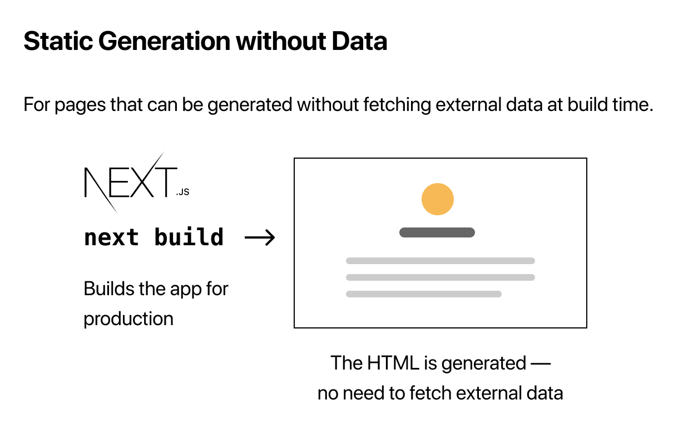

# Pre-rendering and Data Fetching

> Next.js 공식문서 CREATE YOUR FIRST APP 중 [Pre-rendering and Data Fetching](https://nextjs.org/learn/basics/data-fetching)내용들을 정리했습니다.

<br />

우리는 블로그 콘텐츠를 파일 시스템에 저장하지만 콘텐츠가 데이터베이스나 [Headless CMS](https://en.wikipedia.org/wiki/Headless_content_management_system)에 저장되어 있어도 작동한다.

<br />

## 1. Pre-rendering

[데이터 가져오기](https://nextjs.org/docs/basic-features/data-fetching/overview)에 대해 이야기하기 전에 Next.js에서 가장 중요한 개념 중 하나인 [사전 렌더링](https://nextjs.org/docs/basic-features/pages#pre-rendering)에 대해 이야기해 보겠다.

기본적으로 Next.js는 모든 페이지를 사전 렌더링한다. 즉, 클라이언트의 JavaScript에서 모든 작업을 수행하지 않고 Next.js는 미리 각 페이지에 대한 HTML을 생성한다. 사전 렌더링을 통해 더 나은 성능과 [SEO](https://en.wikipedia.org/wiki/Search_engine_optimization)를 얻을 수 있다.

생성된 각 HTML은 해당 페이지에 필요한 최소한의 JavaScript 코드와 연결된다. 페이지가 브라우저에 의해 로드되면 해당 JavaScript 코드가 실행되어 페이지가 완전히 상호 작용하도록 한다. (이 과정을 **hydration**라고 합니다.)

### 1.1. 사전 렌더링이 진행 중인지 확인

다음 단계를 수행하여 사전 렌더링이 진행되고 있는지 확인할 수 있다.

- 브라우저에서 JavaScript를 비활성화하고([Chrome에서 방법 참조](https://developer.chrome.com/docs/devtools/))…
- [이 페이지에 액세스](https://next-learn-starter.vercel.app) (이 튜토리얼의 최종 결과).

앱이 JavaScript 없이 렌더링되는 것을 볼 수 있다. 이는 Next.js가 앱을 정적 HTML로 사전 렌더링했기 때문에 JavaScript를 실행하지 않고도 앱 UI를 볼 수 있다.

> localhost에서 위의 단계를 시도할 수도 있지만 JavaScript를 비활성화하면 CSS가 로드되지 않는다.

앱이 일반 React.js 앱(Next.js 없음)인 경우 [사전 렌더링](https://nextjs.org/docs/basic-features/pages#pre-rendering)이 없으므로 JavaScript를 비활성화하면 앱을 볼 수 없다. 예를 들어:

- 브라우저에서 JavaScript를 활성화하고 [이 페이지를 확인](https://create-react-template.vercel.app/). 이는 [Create React App](https://create-react-app.dev)으로 빌드된 일반 React.js 앱이다.
- 이제 JavaScript를 비활성화하고 [동일한 페이지](https://create-react-template.vercel.app)에 다시 액세스
- 앱이 더 이상 표시되지 않는다. 대신 "이 앱을 실행하려면 JavaScript를 활성화해야 합니다."라고 표시된다. 이는 앱이 정적 HTML로 미리 렌더링되지 않기 때문이다.

### 1.2. Summary: Pre-rendering vs No Pre-rendering


<br />

## 2. Two Forms of Pre-rendering

Next.js에는 [Static Generation](https://nextjs.org/docs/basic-features/pages#static-generation-recommended)(정적 생성)과 [서버 사이드 렌더링](https://nextjs.org/docs/basic-features/pages#server-side-rendering), 두 가지 사전 렌더링 형식이 있다. 차이점은 페이지의 HTML을 생성하는 **시점**이다.

- [정적 생성](https://nextjs.org/docs/basic-features/pages#static-generation-recommended)은 **빌드 시** HTML을 생성하는 사전 렌더링 방법이다. 그러면 미리 렌더링된 HTML은 각 요청에서 재사용된다.

- [서버 사이드 렌더링](https://nextjs.org/docs/basic-features/pages#server-side-rendering)은 각 요청마다 HTML을 생성하는 사전 렌더링 방법이다.


> 개발 모드에서(npm run dev 또는 yarn dev를 실행할 때) 페이지는 모든 요청마다 [미리 렌더링](https://nextjs.org/docs/basic-features/pages#pre-rendering)된다. 이것은 [정적 생성](https://nextjs.org/docs/basic-features/data-fetching/get-static-props#runs-on-every-request-in-development)에도 적용되어 개발하기가 더 쉽다. 프로덕션에서 정적 생성은 **모든 요청이 아닌** 빌드 시 한 번만 발생한다.

### 2.1. Per-page Basis

중요한 점은 Next.js를 사용하면 각 페이지에 사용할 사전 렌더링 양식을 **선택**할 수 있다는 것이다. 대부분의 페이지에는 [정적 생성](https://nextjs.org/docs/basic-features/pages#static-generation-recommended)을 사용하고 다른 페이지에는 [서버 사이드 렌더링](https://nextjs.org/docs/basic-features/pages#server-side-rendering)을 사용하여 "하이브리드" Next.js 앱을 만들 수 있다.


### 2.2. When to Use [Static Generation](https://nextjs.org/docs/basic-features/pages#static-generation-recommended) v.s. [Server-side Rendering](https://nextjs.org/docs/basic-features/pages#server-side-rendering)

페이지를 한 번 빌드하고 CDN에서 제공할 수 있으므로 가능한 한 [정적 생성](https://nextjs.org/docs/basic-features/pages#static-generation-recommended)(데이터 포함 및 제외)을 사용하는 것이 좋다. 이렇게 하면 요청이 있을 때마다 서버에서 페이지를 렌더링하는 것보다 훨씬 빠르다.

다음을 포함하여 다양한 유형의 페이지에 대해 [정적 생성](https://nextjs.org/docs/basic-features/pages#static-generation-recommended)을 사용할 수 있다.

- 마케팅 페이지
- 블로그 게시물
- E-commerce 제품 목록
- 도움말 및 설명서

"사용자 요청에 **앞서** 이 페이지를 미리 렌더링할 수 있습니까?"라고 스스로에게 물어봐야 한다. 대답이 예인 경우 [정적 생성](https://nextjs.org/docs/basic-features/pages#static-generation-recommended)을 선택해야 한다.

반면에 [정적 생성](https://nextjs.org/docs/basic-features/pages#static-generation-recommended)은 사용자 요청보다 먼저 페이지를 미리 렌더링할 수 없는 경우 좋은 생각이 아니다.

페이지에 자주 업데이트되는 데이터가 표시되고 페이지 콘텐츠가 모든 요청에서 변경될 수 있는 경우 [서버 사이드 렌더링](https://nextjs.org/docs/basic-features/pages#server-side-rendering)을 사용할 수 있다. 속도는 느려지지만 미리 렌더링된 페이지는 항상 최신 상태이다. 또는 사전 렌더링을 건너뛰고 클라이언트 측 JavaScript를 사용하여 자주 업데이트되는 데이터를 채울 수 있다.

<br />

## 3. Static Generation with and without Data

[정적 생성](https://nextjs.org/docs/basic-features/pages#static-generation-recommended)은 데이터 유무에 관계없이 수행할 수 있다.

외부 데이터를 가져올 필요가 없는 페이지는 앱이 프로덕션용으로 빌드될 때 자동으로 정적으로 생성된다.



그러나 일부 페이지의 경우 일부 외부 데이터를 먼저 가져오지 않고는 HTML을 렌더링하지 못할 수 있다. 파일 시스템에 액세스하거나 외부 API를 가져오거나 빌드 시 데이터베이스를 쿼리해야 할 수 있다. Next.js는 이 경우([**데이터를 사용한** 정적 생성](https://nextjs.org/docs/basic-features/pages#static-generation-with-data))를 지원한다.


### 3.1. Static Generation with Data using `getStaticProps`

어떻게 작동할까? Next.js에서 페이지 component를 내보낼 때 [`getStaticProps`](https://nextjs.org/docs/basic-features/data-fetching/overview#getstaticprops-static-generation)라는 `비동기` 함수를 내보낼 수도 있다.

- [`getStaticProps`](https://nextjs.org/docs/basic-features/data-fetching/overview#getstaticprops-static-generation)는 프로덕션에서 빌드 시 실행되며…
- 함수 내에서 외부 데이터를 가져와 페이지에 대한 props로 보낼 수 있다.

```jsx
export default function Home(props) { ... }

export async function getStaticProps() {
  // 파일 시스템, API, DB 등에서 외부 데이터 가져오기.
  const data = ...

  // `props` 키의 값은
  // `Home` 컴포넌트로 전달된다.
  return {
    props: ...
  }
}
```

기본적으로 [`getStaticProps`](https://nextjs.org/docs/basic-features/data-fetching/overview#getstaticprops-static-generation)를 사용하면 Next.js에 다음과 같이 알릴 수 있다: "이 페이지에는 약간의 데이터 종속성이 있다. 따라서 빌드 시 이 페이지를 사전 렌더링할 때 먼저 해결해야 한다!"

> 개발 모드에서는 [`getStaticProps`](https://nextjs.org/docs/basic-features/data-fetching/overview#getstaticprops-static-generation)가 대신 각 요청에서 실행된다.

<br />

## 4. Blog Data

## 간단한 블로그 아키텍처 만들기

이 예제의 블로그 게시물은 응용 프로그램의 디렉터리에 로컬 마크다운 파일로 저장되므로(외부 데이터 소스에서 가져오지 않음) 파일 시스템에서 데이터를 읽어야 한다.

이 섹션에서는 파일 시스템에서 마크다운 데이터를 읽는 블로그를 만드는 단계를 살펴보겠다.

### 4.1. 마크다운 파일 만들기

먼저 루트 폴더에 **`posts`**(`pages/posts`이 아님)이라는 새 최상위 디렉터리를 만든다. `posts` 내부에 `pre-rendering.md` 및 `ssg-ssr.md`라는 두 개의 파일을 만든다.

이제 다음 코드를 `posts/pre-rendering.md`에 복사:

```markdown
---
title: "Two Forms of Pre-rendering"
date: "2020-01-01"
---

Next.js has two forms of pre-rendering: **Static Generation** and **Server-side Rendering**. The difference is in **when** it generates the HTML for a page.

- **Static Generation** is the pre-rendering method that generates the HTML at **build time**. The pre-rendered HTML is then _reused_ on each request.
- **Server-side Rendering** is the pre-rendering method that generates the HTML on **each request**.

Importantly, Next.js lets you **choose** which pre-rendering form to use for each page. You can create a "hybrid" Next.js app by using Static Generation for most pages and using Server-side Rendering for others.
```

그런 다음 다음 코드를 `posts/ssg-ssr.md`에 복사:

```markdown
---
title: "When to Use Static Generation v.s. Server-side Rendering"
date: "2020-01-02"
---

We recommend using **Static Generation** (with and without data) whenever possible because your page can be built once and served by CDN, which makes it much faster than having a server render the page on every request.

You can use Static Generation for many types of pages, including:

- Marketing pages
- Blog posts
- E-commerce product listings
- Help and documentation

You should ask yourself: "Can I pre-render this page **ahead** of a user's request?" If the answer is yes, then you should choose Static Generation.

On the other hand, Static Generation is **not** a good idea if you cannot pre-render a page ahead of a user's request. Maybe your page shows frequently updated data, and the page content changes on every request.

In that case, you can use **Server-Side Rendering**. It will be slower, but the pre-rendered page will always be up-to-date. Or you can skip pre-rendering and use client-side JavaScript to populate data.
```

> 각 마크다운 파일의 맨 위에는 `제목`과 `날짜`가 포함된 메타데이터 섹션이 있다. 이를 YAML Front Matter라고 하며 [gray-matter](https://github.com/jonschlinkert/gray-matter)이라는 라이브러리를 사용하여 구문 분석(parsing)할 수 있다.

### 4.2. gray-matter 설치

먼저 각 마크다운 파일의 메타데이터를 구문 분석(parsing)할 수 있는 [gray-matter](https://github.com/jonschlinkert/gray-matter)을 설치한다.

```shell
npm install gray-matter
```

### 4.3. 파일 시스템을 읽기 위한 유틸리티 함수 만들기

다음으로 파일 시스템에서 데이터를 구문 분석하기 위한 유틸리티 함수를 만든다. 이 유틸리티 기능을 사용하여 다음을 수행하고자 한다.

- 각 마크다운 파일을 구문 분석하고 `제목`, `날짜` 및 파일 이름(포스트 URL의 `id`로 사용됨)을 가져온다.
- 인덱스 페이지에 날짜별로 정렬된 데이터를 나열한다.

루트 디렉터리에 `lib`라는 최상위 디렉터리를 만든다. 그런 다음 `lib` 내에서 `posts.js`라는 파일을 만들고 이 코드를 복사하여 붙여넣는다.

```javascript
import fs from "fs";
import path from "path";
import matter from "gray-matter";

const postsDirectory = path.join(process.cwd(), "posts");

export function getSortedPostsData() {
  // /posts에서 파일 이름 가져오기
  const fileNames = fs.readdirSync(postsDirectory);
  const allPostsData = fileNames.map((fileName) => {
    // id를 얻으려면 파일 이름에서 ".md"를 제거
    const id = fileName.replace(/\.md$/, "");

    // 마크다운 파일을 문자열로 읽기
    const fullPath = path.join(postsDirectory, fileName);
    const fileContents = fs.readFileSync(fullPath, "utf8");

    // gray-matter을 사용하여 게시물 메타데이터 섹션을 구문 분석한다.
    const matterResult = matter(fileContents);

    // 데이터를 id와 결합
    return {
      id,
      ...matterResult.data,
    };
  });
  // 게시물을 날짜별로 정렬
  return allPostsData.sort((a, b) => {
    if (a.date < b.date) {
      return 1;
    } else {
      return -1;
    }
  });
}
```

> Next.js를 배우기 위해 위의 코드가 무엇을 하는지 이해할 필요는 없다. 함수는 블로그 예제를 기능적으로 만드는 것이다. 그러나 더 자세히 알고 싶다면:
>
> - [`fs`](https://nodejs.org/api/fs.html#fsreaddirsyncpath-options)는 파일 시스템에서 파일을 읽을 수 있는 Node.js 모듈
> - [`path`](https://nodejs.org/api/path.html#pathjoinpaths)는 파일 경로를 조작할 수 있는 Node.js 모듈
> - [`matter`](https://www.npmjs.com/package/gray-matter)는 각 마크다운 파일의 메타데이터를 파싱할 수 있는 라이브러리
> - Next.js에서 lib 폴더에는 pages 폴더와 같은 할당된 이름이 없으므로 아무 이름이나 지정할 수 있다. 일반적으로 lib 또는 utils를 사용하는 것이 관례이다.

### 4.4. Fetching the blog data

이제 블로그 데이터가 구문 분석되었으므로 인덱스 페이지(`pages/index.js`)에 추가해야 한다. [`getStaticProps()`](https://nextjs.org/docs/basic-features/data-fetching/overview#getstaticprops-static-generation)라는 Next.js 데이터 fetching 메서드를 사용하여 이 작업을 수행할 수 있다. 다음 섹션에서는 `getStaticProps()`를 구현하는 방법을 배운다.


