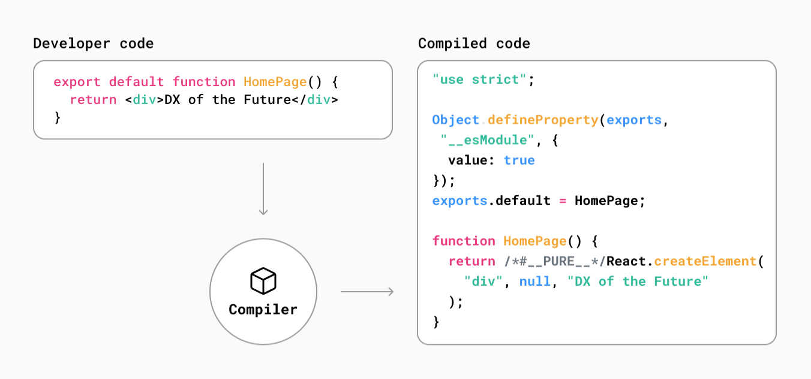

# How Next.js Works

> Next.js 공식문서 중 [How Next.js Works](https://nextjs.org/learn/foundations/how-nextjs-works)를 읽고 내용 정리

 

## 1. From Development to Production

### 1.1. Development & Production Environments

- **환경(environments)**: 코드가 실행되는 맥락(context)

- Development하는 동안은 로컬 시스템에서 애플리케이션을 빌드하고 실행한다.
- Development 환경에서 [Production 환경으로 이동](https://nextjs.org/docs/going-to-production#caching)하는 것은 애플리케이션을 배포해서 사용자가 사용할 수 있도록 준비하는 프로세스이다.

### 1.2. Next.js에 적용되는 방식

- Development 단계에서 Next.js는 최적화된 애플리케이션 구축 환경을 제공한다: [TypeScript](https://nextjs.org/docs/basic-features/typescript) 및 [ESLint 통합](https://nextjs.org/docs/basic-features/eslint), [Fast Refresh](https://nextjs.org/docs/basic-features/fast-refresh) 등과 같은 기능이 함께 제공된다.
- Production 단계에서 Next.js는 성능과 접근성을 고려한 최적화된 코드로 변환 -> 사용자에게 최적화된 애플리케이션 사용 경험을 제공

- 환경마다 고려 사항과 목표가 다르기 때문에 애플리케이션을 Development에서 Production으로 이동하려면 해야 할 일이 많다: 코드는 <U>**[컴파일](https://nextjs.org/learn/foundations/how-nextjs-works/compiling)**</U>, <U>**[번들링](https://nextjs.org/learn/foundations/how-nextjs-works/bundling)**</U>, <U>**[축소](https://nextjs.org/learn/foundations/how-nextjs-works/minifying)**</U> 및 <U>**[코드 분할](https://nextjs.org/learn/foundations/how-nextjs-works/code-splitting)**</U> 된다.

### 1.3. Next.js Compiler

- Next.js는 이러한 코드 변환의 대부분과 기본 인프라를 처리한다. -> 프로덕션으로 더 쉽게 전환할 수 있다.
- 이것은 Next.js에 다음 두가지가 있기 때문에 가능하다.
  - 저수준 프로그래밍 언어인 Rust로 작성된 **[컴파일러](https://nextjs.org/docs/advanced-features/compiler)**
  - 컴파일, 축소, 번들링 등에 사용할 수 있는 플랫폼인 **SWC**

 

## 2. Compiling

### 2.1. What is Compiling?

**컴파일**: 한 언어로 된 코드를 다른 언어 또는 해당 언어의 다른 버전으로 출력하는 프로세스

최근 개발자들은 JSX, TypeScript 및 최신 버전의 JavaScript로 코드를 작성한다. 이러한 방법는 개발자의 효율성과 자신감을 향상시키지만 브라우저가 이 코드를 이해려면 코드를 먼저 JavaScript로 컴파일해야 한다.

Next.js에서 컴파일은 개발 단계에서 코드를 편집할 때 발생하며 프로덕션을 위해 애플리케이션을 준비하는 빌드 단계의 일부로 발생한다.
