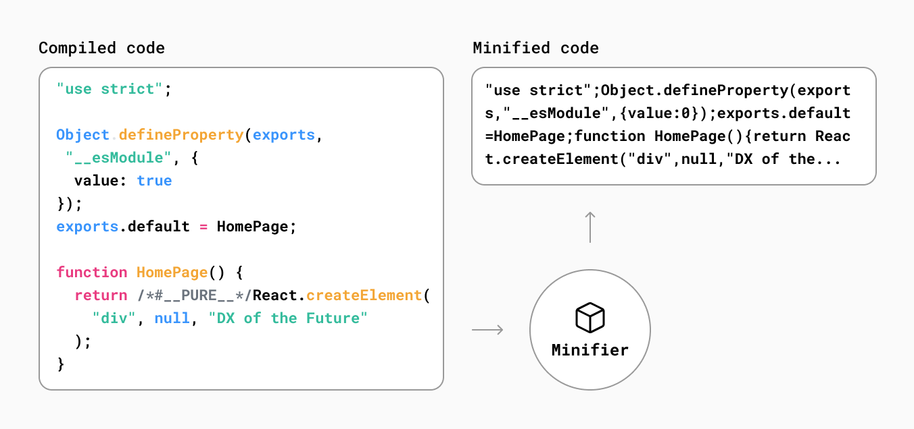
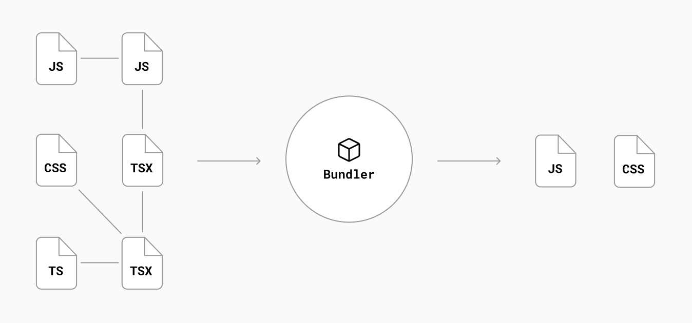
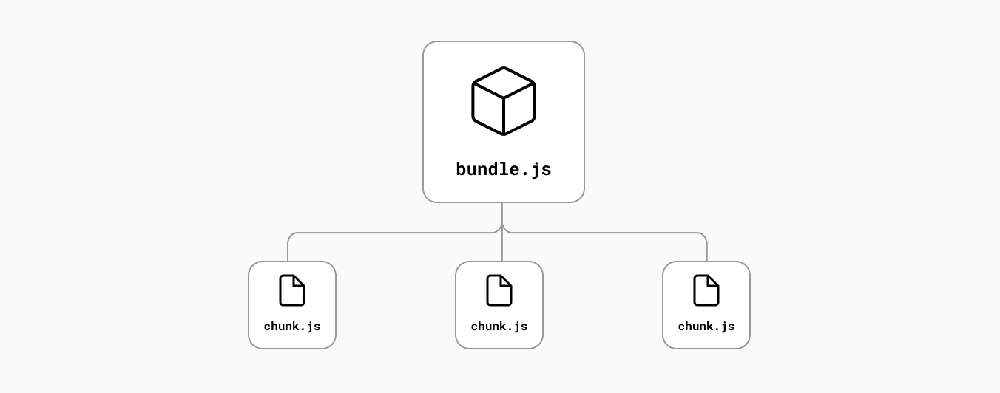
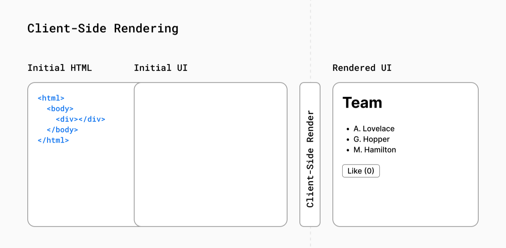
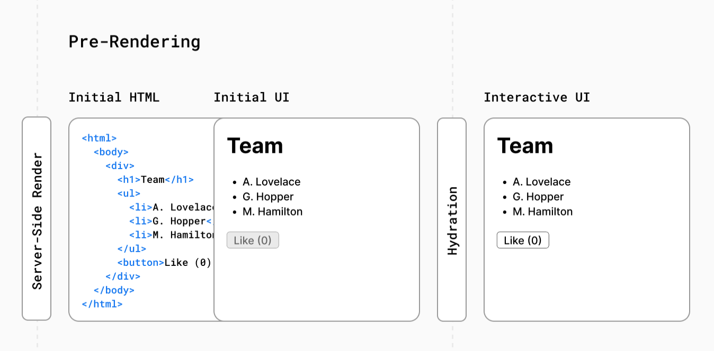
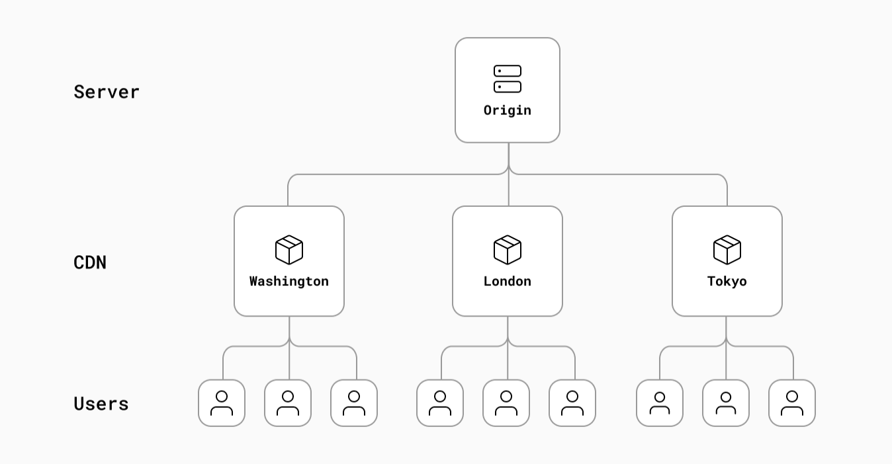

# How Next.js Works

> Next.js 공식문서 중 [How Next.js Works](https://nextjs.org/learn/foundations/how-nextjs-works)를 읽고 내용 정리

 

## 1. From Development to Production

### 1.1. Development & Production Environments

- **환경(environments)**: 코드가 실행되는 맥락(context)

- Development하는 동안은 로컬 시스템에서 애플리케이션을 빌드하고 실행한다.
- Development 환경에서 [Production 환경으로 이동](https://nextjs.org/docs/going-to-production#caching)하는 것은 애플리케이션을 배포해서 사용자가 사용할 수 있도록 준비하는 프로세스이다.

### 1.2. Next.js에 적용되는 방식

- Development 단계에서 Next.js는 최적화된 애플리케이션 구축 환경을 제공한다: [TypeScript](https://nextjs.org/docs/basic-features/typescript) 및 [ESLint 통합](https://nextjs.org/docs/basic-features/eslint), [Fast Refresh](https://nextjs.org/docs/basic-features/fast-refresh) 등과 같은 기능이 함께 제공된다.

- Production 단계에서 Next.js는 성능과 접근성을 고려한 최적화된 코드로 변환 -> 사용자에게 최적화된 애플리케이션 사용 경험을 제공

- 환경마다 고려 사항과 목표가 다르기 때문에 애플리케이션을 Development에서 Production으로 이동하려면 해야 할 일이 많다: 코드는 <U>**[컴파일](https://nextjs.org/learn/foundations/how-nextjs-works/compiling)**</U>, <U>**[번들링](https://nextjs.org/learn/foundations/how-nextjs-works/bundling)**</U>, <U>**[축소](https://nextjs.org/learn/foundations/how-nextjs-works/minifying)**</U> 및 <U>**[코드 분할](https://nextjs.org/learn/foundations/how-nextjs-works/code-splitting)**</U> 된다.

### 1.3. Next.js Compiler

- Next.js는 이러한 코드 변환의 대부분과 기본 인프라를 처리한다. -> 프로덕션으로 더 쉽게 전환할 수 있다.

- 이것은 Next.js에 다음 두가지가 있기 때문에 가능하다.
  - 저수준 프로그래밍 언어인 Rust로 작성된 **[컴파일러](https://nextjs.org/docs/advanced-features/compiler)**
  - 컴파일, 축소, 번들링 등에 사용할 수 있는 플랫폼인 **SWC**

 

## 2. Compiling

**컴파일**: 한 언어로 된 코드를 다른 언어 또는 해당 언어의 다른 버전으로 출력하는 프로세스

최근 개발자들은 JSX, TypeScript 및 최신 버전의 JavaScript로 코드를 작성한다. 이러한 방법는 개발자의 효율성과 자신감을 향상시키지만 <U>브라우저가 이 코드를 이해려면 코드를 먼저 JavaScript로 컴파일</U>해야 한다.

Next.js에서 컴파일은 개발 단계에서 코드를 편집할 때 발생하며 프로덕션을 위해 애플리케이션을 준비하는 빌드 단계의 일부로 발생한다.

 

## 3. Minifying

개발자는 사람의 입장에서 가독성에 최적화된 코드를 작성한다. 이는 주석, 공백, 들여쓰기, 여러 줄 등 코드 실행에 필요하지 않은 정보가 포함되어있다는 뜻이다.

**최소화**: 코드의 기능을 변경하지 않고 불필요한 코드 서식과 주석을 제거하는 프로세스 -> 파일 크기를 줄여 애플리케이션의 성능을 향상

Next.js에서 JavaScript 및 CSS 파일은 프로덕션을 위해 자동으로 minify(축소) 된다.

cf) syntax highlighting은 코드 에디터에서 제공해주는 기능이라 최소화와는 무관하다.

 

## 4. Bundling

개발한 어플리케이션이 더 커질수록 module, component 및 function을 자연스레 나누게 된다. 이렇듯 내부 module과 third-party package를 export, import하면서 파일 종속성(dependency)이 복잡한 웹이 만들어진다.

**번들링**: 종속성 웹을 해결하고 파일(또는 모듈)을 브라우저에 최적화된 번들로 병합(또는 '패키징')하는 프로세스 -> 사용자가 웹 페이지를 방문할 때 파일에 대한 요청 수를 줄여준다.

 

## 5. Code Splitting

일반적으로 애플리케이션을 서로 다른 URL에서 액세스할 수 있는 여러 페이지로 분할한다. 각 페이지는 어플리케이션의 진입점이 된다.

**코드 분할**: 애플리케이션의 번들을 각 진입점에 필요한 작은 청크로 분할하는 프로세스 -> 해당 페이지를 실행하는 데 필요한 코드만 로드하여 애플리케이션의 초기 로드 시간을 개선

Next.js는 코드 분할을 기본적으로 지원한다. `pages/` 디렉토리 내의 각 파일은 빌드 단계에서 자체 자바스크립트 번들로 자동으로 코드 분할된다.

Further:

- 페이지 간에 공유되는 모든 코드는 추가 탐색에서 동일한 코드를 다시 다운로드하지 않도록 다른 번들로 분할된다.
- 초기 페이지 로드 후 Next.js는 사용자가 탐색할 가능성이 있는 다른 페이지의 [코드를 미리 로드](https://nextjs.org/docs/api-reference/next/link)할 수 있다.
- [Dynamic imports](https://nextjs.org/docs/advanced-features/dynamic-import): 처음에 로드된 코드를 수동으로 분할하는 방법

 

## 6. Build Time vs. Runtime

**Build time**(or build step): 프로덕션을 위해 애플리케이션 코드를 준비하는 일련의 단계 명칭

애플리케이션을 빌드할 때 Next.js는 [서버](https://nextjs.org/learn/foundations/how-nextjs-works/client-and-server)에 배포해서 사용자가 사용할 수 있게 코드를 프로덕션 최적화 파일로 변환한다. 변환 파일은 다음을 포함한다:

- 정적 페이지용 HTML 파일
- [서버](https://nextjs.org/learn/foundations/how-nextjs-works/client-and-server)에서 페이지를 [렌더링](https://nextjs.org/learn/foundations/how-nextjs-works/rendering)하기 위한 JavaScript 코드
- [클라이언트](https://nextjs.org/learn/foundations/how-nextjs-works/client-and-server)에서 interactive한 페이지를 만들기 위한 JavaScript 코드
- CSS 파일

 

**Runtime**(or request time): 애플리케이션이 빌드 및 배포된 후 사용자 요청에 대한 응답으로 애플리케이션이 실행되는 기간

 

## 7. Client and Server

웹 애플리케이션에서 **클라이언트**는 응용 프로그램 코드에 대한 요청을 서버에 보내는 사용자 장치의 브라우저를 가리킨다. 클라이언트는 서버에서 받은 응답을 사용자와 상호 작용하는 인터페이스로 바꾼다.

**서버**: 애플리케이션 코드를 저장하고, 클라이언트로부터 요청을 받고, 계산을 수행하고, 적절한 응답을 다시 보내는 데이터 센터의 컴퓨터

 

## 8. Rendering

### 8.1. What is Rendering?

**렌더링**: React에서 작성한 코드(JSX)를 UI의 HTML으로 변환하는 프로세스

렌더링은 서버 또는 클라이언트에서, build time 또는 runtime의 모든 요청에서 발생할 수 있다.

Next.js를 사용하면 서버 사이드 렌더링(SSR), 정적 사이트 생성(SSG) 및 클라이언트 사이드 렌더링(CSR) 세 가지 렌더링 방법을 사용할 수 있다.

### 8.2. Pre-Rendering

서버 사이드 렌더링(SSR) 및 정적 사이트 생성(SSG)은 결과물을 클라이언트로 전송하기 전에 외부 데이터를 가져와서 React component들을 HTML로 변환하기 때문에 **Pre-Rendering**이라고도 한다.

### 8.3. Client-Side Rendering vs. Pre-Rendering

표준 React 애플리케이션에서 브라우저는 UI를 구성하기 위해 서버에서 JavaScript와 빈 HTML을 받는다. 초기 렌더링 작업은 사용자 장치에서 발생하므로 이를 클라이언트 측 렌더링이라고 한다.

> React의 useEffect() 또는 [useSWR](https://swr.vercel.app/ko)과 같은 data fetching hook으로 데이터를 가져오도록 해서 Next.js 애플리케이션의 특정 component가 클라이언트 사이드 렌더링하도록 할 수 있다.

Next.js는 기본적으로 모든 페이지를 **pre-render**한다. pre-rendering은 HTML이 사용자 장치의 JavaScript에 의해 모두 생성되는 대신 서버에서 미리 생성됨을 의미한다.

완전히 클라이언트 사이드 렌더링된 앱의 경우 렌더링 작업이 수행되는 동안 사용자는 빈 페이지를 보게된다. 사용자가 구성된 HTML을 볼 수 있는 pre-rendering 앱과 비교해보자:

### 8.4. Server-Side Rendering

서버 사이드 렌더링을 사용하면 페이지의 HTML이 각 요청에 따라 서버에서 생성된다. 그런 다음 생성된 HTML, JSON 데이터 및 페이지를 interactive하게 만들기 위한 JavaScript가 클라이언트로 전송된다.

클라이언트에서 pre-render 한 HTML로 non-interactive 한 페이지를 빠르게 보여주는 동안 React가 JSON 데이터 및 JavaScript로 component를 interactive 하게 만든다 (ex. 버튼에 이벤트 핸들러 첨부). 이 과정을 **hydration**이라고 한다.

Next.js에서 [getServerSideProps](https://nextjs.org/docs/basic-features/data-fetching/get-server-side-props)를 사용하여 서버 사이드 렌더링 페이지를 구현할 수 있다.

> React 18 및 Next 12에는 **React server components**의 알파 버전이 도입되었다. Server components는 서버에서 완전히 렌더링되며 렌더링을 위해 클라이언트 사이드 JavaScript가 필요하지 않다. 또한 server components를 사용하면 로직은 서버에 두고 로직의 결과만 클라이언트에 보낼 수 있다. 이렇게 하면 클라이언트로 전송되는 번들 크기가 줄어들고 클라이언트 측 렌더링 성능이 향상된다. [React server components에 대해 자세히 알아보기](https://reactjs.org/blog/2020/12/21/data-fetching-with-react-server-components.html).

### 8.5. Static Site Generation

정적 사이트 생성을 사용하면 HTML이 서버에서 생성되지만 서버 사이드 렌더링과 달리 런타임에는 서버가 없다. 대신 콘텐츠는 애플리케이션이 배포되는 build time에 한 번 생성되며 HTML은 [CDN](https://nextjs.org/learn/foundations/how-nextjs-works/cdns-and-edge)에 저장되고 각 요청에 대해 재사용된다.

Next.js에서 [getStaticProps](https://nextjs.org/docs/basic-features/data-fetching/get-static-props)를 사용하여 페이지를 정적으로 생성할 수 있다.

> [Incremental Static Regeneration](https://nextjs.org/docs/basic-features/data-fetching/incremental-static-regeneration)을 사용하여 사이트를 구축한 후 정적 페이지를 만들거나 업데이트할 수 있다. 즉, 데이터가 변경되더라도 전체 사이트를 재구축할 필요가 없다.

Next.js의 장점은 정적 사이트 생성, 서버 사이드 렌더링 또는 클라이언트 사이드 렌더링 중 페이지별로 가장 적절한 렌더링 방법을 선택할 수 있다는 것이다. 적합한 렌더링 방법을 선택하는 것에 대해 자세히 알고싶다면 [data fetching docs](https://nextjs.org/docs/basic-features/data-fetching/overview)를 참조.

 

## 9. CDNs and the Edge

### 9.1. What is the Network?

네트워크에 배포된 후 애플리케이션 코드가 저장되고 실행되는 위치를 아는 것은 도움이 될 수 있다. 네트워크는 리소스를 공유할 수 있는 컴퓨터(또는 서버)로 보면 된다. Next.js 애플리케이션의 경우 애플리케이션 코드를 **원본 서버**, **CDN(Content Delivery Network)** 및 **Edge**에 배포할 수 있다.

#### `Origin Servers (원본 서버)`

앞에서 설명한 것처럼 서버는 애플리케이션 코드의 원래 버전을 저장하고 실행하는 주 컴퓨터를 가리킨다.

**CDN 서버** 및 **에지 서버**와 같이 응용 프로그램 코드가 배포될 수 있는 다른 위치와 구별하기 위해 **원본 (origin)**이라는 용어를 사용한다.

원본 서버가 요청을 받으면 응답을 보내기 전에 일부 계산을 수행한다. 이 계산 작업의 결과는 CDN(Content Delivery Network)으로 이동할 수 있다.

#### `Content Delivery Network (CDN)`

CDN은 전 세계 여러 위치에 정적 콘텐츠(예: HTML 및 이미지 파일)를 저장하고 있고, 클라이언트와 원본 서버 사이에 배치된다. 새로운 요청이 들어오면 사용자와 가장 가까이 있는 CDN이 캐시된 결과를 응답할 수 있다.

각 요청마다 계산할 필요가 없기 때문에 오리진의 부하가 줄어든다. 또한 지리적으로 더 가까운 위치에서 응답이 오기 때문에 사용자가 더 빠르게 작업할 수 있다.

Next.js에서는 pre-rendering을 미리 수행해서 CDN에 작업의 정적 결과를 저장할 수 있으므로 콘텐츠 전달 속도를 빨르게 할 수 있다.

#### `The Edge`

Edge는 사용자에게 가장 가까운 네트워크 주변부(또는 가장자리)라는 의미를 가진다. CDN은 네트워크의 주변부(또는 가장자리)에 정적 콘텐츠를 저장하기 때문에 "the Edge"의 일부로 간주될 수 있다.

CDN과 유사하게 에지 서버는 전 세계 여러 위치에 배포된다. 그러나 정적 콘텐츠만을 저장하는 CDN과 달리 일부 에지 서버는 코드를 실행할 수 있다.

이는 **캐싱**과 **코드 실행** 모두 사용자에게 더 가까운 Edge에서 수행할 수 있음을 의미한다.

Edge에서 코드를 실행할 수 있다는건 전통적으로 클라이언트 측 또는 서버 측에서 수행되었던 일부 작업을 Edge로 이동할 수 있다는 것을 의미한다([여기에서 Next.js의 예 참조](https://vercel.com/features/edge-functions)). 이렇게 하면 클라이언트로 전송되는 코드의 양이 줄어들고 사용자 요청의 일부가 원본 서버로 다시 돌아갈 필요가 없으므로 대기 시간이 줄어든다. 때문에 애플리케이션의 성능이 향상될 수 있다.

Next.js에서는 Edge에서 [미들웨어](https://nextjs.org/docs/advanced-features/middleware)로 코드를 실행할 수 있으며 곧 [React Server Components](https://nextjs.org/docs/advanced-features/react-18/overview#react-server-components-alpha) 코드를 실행할 수 있다.
