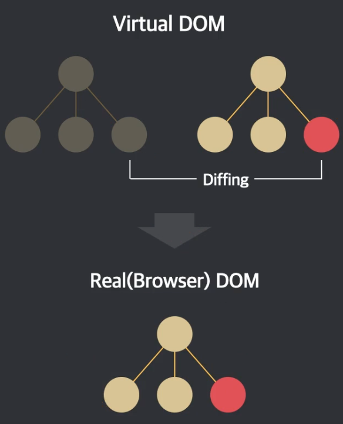

# Svelte의 특징

> 인프런의 [Svelte.js [Core API] 완벽 가이드](https://www.inflearn.com/course/%EC%8A%A4%EB%B2%A8%ED%8A%B8-%EC%99%84%EB%B2%BD-%EA%B0%80%EC%9D%B4%EB%93%9C)의 내용을 학습 후 정리 했습니다.

 

## 1. Write less code

- 높은 가독성 유지
- 개발 시간 단축
- 쉬운 리팩터링
- 쉬운 디버깅
- 더 작은 번들(SPA 최적화, 최초 로딩시 리소스가 많이 필요한 단점을 보완할 수 있다.)
- 낮은 러닝 커브

## 2. No virtual DOM!

- No Diffing

  

  - Diffing: 기존에 만들어 놓은 가상 DOM과 변경된 상태를 기준으로 만든 가상 DOM을 비교해서 차이점을 찾아내는 과정

  - 차이를 발견하면 차이가 있는 부분만 갱신 (전체 DOM을 모두 바꾸는 리소스가 크게 드는 행위를 안할 수 있음)

  - 새로운 가상 DOM을 생성 -> 기존의 가상 DOM과 비교 -> 비교의 결과에 따라 화면 갱신

  - Svelte에서는 가상 DOM을 생성하고 비교하는 과정이 없다. -> No Diffing (갱신만 한다)

- No Overhead

  - 가상 DOM의 생성과 비교 등의 행위가 일어날 때 여러 리소스가 들어간다.

  - Overhead: 어떤 처리를 위해 들어가는 간접적인 시간이나 메모리 등을 말한다.

  - Svelte는 바로 화면을 갱신 -> No Overhead

- 빠른 성능(퍼포먼스)

  - 브라우저 환경(런타임)에서 No Diffing, No Overhead로 좋은 성능을 낸다. (메모리 절약)

  - React에 비해 메모리 사용에서 2~4배 차이난다.

## 3. Truly reactive (가상 DOM을 사용하지 않는 진정한 반응성)

- Framework-less Vanilla JS

  - 브라우저 환경(런타임)에서 가상 DOM을 사용하려면 React와 Vue를 브라우저 환경으로 가지고 와야한다. 이는 용량, 메모리, 시간이 들 수밖에 없다.(오버헤드 발생)

  - Svelte 같은 경우 런타임에서 프레임워크가 사용되지 않는다. Svelte는 코드를 순수한 JS(Vanilla JS)로 결과물을 만들어서 브라우저에서 동작시킨다.

- Only use `devDependencies`

  - Svelte 같은 경우 컴파일러 역할을 한다. -> 브라우저에 프레임워크가 포함되지 않는다.

  - 그렇기 때문에 개발 의존성 모듈로만 외부 모듈을 설치해서 관리해도 잘 동작한다.

  - Svelte가 작업물(애플리케이션)을 VanillaJS로 변환(컴파일)하고 그 결과만 동작하기 때문에 Svelte는 브라우저(런타임)에서 동작하지 않는 컴파일러라고 할 수 있다.

- 명시적 설계(창의적 작업)

  - Svelte는 변수를 직접 변경하므로써 반응성을 가진다. (반응성을 직접적으로 명시)

  - Svelte는 가상 DOM을 사용하지 않고 개발자가 작성해놓은 코드를 보고 언제 반응성이 일어나는지 미리 알 수 있으며 이를 바탕으로 순수한 JS로 결과물을 만들고 그 결과물을 브라우저에서 동작시킨다.

  - 브라우저에서 동작하는 환경에 최적화하고 반응성도 유지할 수 있다.

  - Svelte의 자유도가 비교적 높기 때문에 호출 스택이나 데이터의 메모리 참조 등 JavaScript의 동작 원리들을 이해하는 것이 중요하다. -> 창의적 작업 가능

> 반응성: 애플리케이션 상태(데이터)의 변화가, DOM에 자동으로 반영되는 현상을 말한다.

## 4. 단점

- 낮은 성숙도(작은 생태계)

- CDN 미제공

  - Svelte의 경우 런타임에서 동작하지 않기 때문에 CDN으로 제공하는 것이 불가능 하다.
  - CDN으로 Svelte를 제공해서 브라우저에서 직접 동작시킬 수 없다.

- IE 지원
