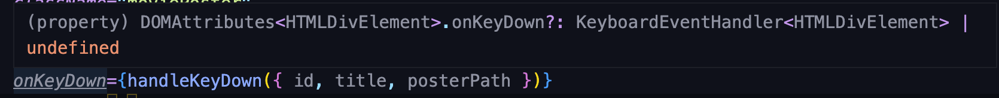

# TypeSciprt에서 event type
>이벤트의 타입을 정해주라는 TypeScipt에러를 발견하고 학습했습니다.

### 1. onEvent에 커서 올려보기

- 마우스를 올려보면 KeyboardEventHandler<HTMLDivElement>가 필요하다는 것을 알 수 있다.
- Handler는 이벤트를 처리해주는 함수이므로 풀어서 정리하면 다음과 같다.
    ```typescript
    type KeyboardEventHandler = (event: KeyboardEvent<HTMLDivElement>) => void;
    ```
- KeyboardEvent type은 React에서 제공해준다.
- 다른 이벤트와 태그에서도 똑같은 방법으로 해결하면 된다.

### 완성코드
```typescript
import { KeyboardEvent } from 'react';

function handleKeyDown(event: KeyboardEvent<HTMLDivElement>) {
    // ...
}
```